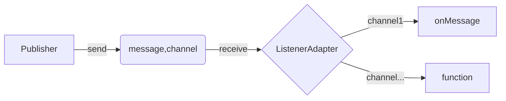

# Spring Boot Pub-Sub and Stream Data in Redis Guide

## List of Topics

- **Learning Pub/Sub Pattern**
  - Basics of the publish-subscribe pattern.
  - Benefits and use cases in microservices.
  - 
- **Learning Redis key's expire**
  - Basic example for generate expirable entity through controller

- **Learning about Stream**
  - Fundamentals of streaming data.
  - Roles of producers and consumers in streaming.

- **Project: Stream a String and Entity**
  - Create a project to stream data.
  - Stream both text (strings) and objects (entities) in one project.

- **Additional Project's (Review knowledge)**
	- **Transfer Strings Between Projects**
		  - Set up a project to send and receive text data between different projects.

	- **Transfer Entities Between Projects and Save to Database**
		  - Create a project to transfer objects between projects.
		  - Save the transferred objects to a database.

## Learning Pub/Sub Pattern

The date range is: **May 20th - May 22nd, 2024**
### Pub-sub Flow


### Redis Simple Configuration
#### application.properties
```properties
# Redis Config
redis.host=localhost
redis.port=6379
redis.topic=pubSub_channel
```
#### Redis Configuration
```java
public class RedisConfiguration {
    private static final Logger log = LoggerFactory.getLogger(RedisConfiguration.class);
    // application.properties
    @Value("${redis.host}")
    private String redisHost;

    @Value("${redis.port}")
    private int redisPort;

    @Bean
    public RedisMessageListenerContainer container(RedisConnectionFactory redisConnectionFactory, MessageListenerAdapter messageListenerAdapter) {
        RedisMessageListenerContainer redisMessageListenerContainer = new RedisMessageListenerContainer();
        redisMessageListenerContainer.setConnectionFactory(redisConnectionFactory);
        redisMessageListenerContainer.addMessageListener(messageListenerAdapter, channelTopic());
        return redisMessageListenerContainer;
    }


    @Bean
    MessageListenerAdapter messageListenerAdapter() {
        return new MessageListenerAdapter(new RedisMessageSubscriber(), "onMessage");
    }

    @Bean
    public LettuceConnectionFactory redisConnectionFactory() {
        // Tạo Standalone Connection tới Redis
        return new LettuceConnectionFactory(new RedisStandaloneConfiguration(redisHost, redisPort));
    }

    @Bean
    @Primary
    public RedisTemplate<Object, Object> redisTemplate(RedisConnectionFactory redisConnectionFactory) {
        RedisTemplate<Object, Object> redisTemplate = new RedisTemplate<>();
        redisTemplate.setConnectionFactory(redisConnectionFactory);
        redisTemplate.setValueSerializer(new GenericToStringSerializer<Object>(Object.class));
        return redisTemplate;
    }
}
```
### Pub-sub channel implement (both sides)
```java
public class RedisConfiguration {
   ...
    // application.properties
    @Value("${redis.topic:channel-events}")
    private String topic;
    
   @Bean
    public ChannelTopic channelTopic() {
        return new ChannelTopic(topic);
    }
}
```

### Publisher Implementation
#### Redis Configuration
```java
public class RedisConfiguration {
   ...
   @Bean
    MessagePublisher messagePublisher() {
        return new RedisMessagePublisher(redisTemplate(redisConnectionFactory()), channelTopic());
    }
}
```

#### Interface
```java
public interface MessagePublisher {
    void publish(String message);
}
```
#### RedisMessagePublisher
```java
@Component
public class RedisMessagePublisher implements MessagePublisher {
  @Autowired 
  private final RedisTemplate<Object, Object> redisTemplate;
  @Autowired
  private final ChannelTopic topic;
  
  public RedisMessagePublisher(RedisTemplate<Object, Object> redisTemplate, ChannelTopic topic) {
    this.redisTemplate = redisTemplate; this.topic = topic; 
  }
  
  @Override
  public void publish(String message) {    
    redisTemplate.convertAndSend(topic.getTopic(), message); 
  }
}
```
***Explain***: Send a message to channel
### Subscriber Implementation
#### Redis Configuration
```java
public class RedisConfiguration {
   ...
   @Bean
    public RedisMessageListenerContainer container(RedisConnectionFactory redisConnectionFactory, MessageListenerAdapter messageListenerAdapter) {
        RedisMessageListenerContainer redisMessageListenerContainer = new RedisMessageListenerContainer();
        redisMessageListenerContainer.setConnectionFactory(redisConnectionFactory);
        redisMessageListenerContainer.addMessageListener(messageListenerAdapter, channelTopic());
        return redisMessageListenerContainer;
    }


    @Bean
    MessageListenerAdapter messageListenerAdapter() {
        return new MessageListenerAdapter(new RedisMessageSubscriber(), "onMessage");
    }
}
```
***Explain***: Each time message come to channel -> exec "onMessage"
#### RedisMessageSubscriber 
```java
@Service
public class RedisMessageSubscriber implements MessageListener {
    public static List<String> messageList = new ArrayList<>();

    @Override
    public void onMessage(Message message, byte[] bytes){
        messageList.add(message.toString());
        System.out.println("Message received:"+message.toString());
    }
}
```
## **Learning Redis key’s expire**
The date range is: **May 23rd 2024**
### Config
#### application.properties
```properties
# Redis Config
...
redis.timeToLive = 30L
redis.sessionLive = 5000L
```
#### Redis Configuration
```java
@Configuration
@EnableRedisRepositories(enableKeyspaceEvents = RedisKeyValueAdapter.EnableKeyspaceEvents.ON_STARTUP)
public class RedisConfiguration {
    ...
    @Bean
    public RedisMappingContext keyValueMappingContext() {
        return new RedisMappingContext(new MappingConfiguration(new IndexConfiguration(), new MyKeyspaceConfiguration()));
    }

    public static class MyKeyspaceConfiguration extends KeyspaceConfiguration {

        @Override
        protected @NotNull Iterable<KeyspaceSettings> initialConfiguration() {
            KeyspaceSettings keyspaceSettings = new KeyspaceSettings(Session.class, "session");
            Long redisTimeToLive = 60L;
            keyspaceSettings.setTimeToLive(redisTimeToLive);
            return Collections.singleton(keyspaceSettings);
        }
    }

    @Component
    public static class SessionExpiredEventListener {
        @EventListener
        public void handleRedisKeyExpiredEvent(RedisKeyExpiredEvent<Session> event) {
            Session expiredSession = (Session) event.getValue();
            assert expiredSession != null;
            log.info("Session with key={} has expired", expiredSession.getId());
        }
    }
}
```
-   **@EnableRedisRepositories**: This is a special annotation in Spring that tells your application to use Redis, a type of database, and to enable repositories, which are like libraries that help your application store and retrieve data.
    
-   **enableKeyspaceEvents = RedisKeyValueAdapter.EnableKeyspaceEvents.ON_STARTUP**: This part is a setting that tells Redis (the database) to start paying attention to certain types of events (like when data changes) from the moment your application starts up.
-  **Others**: declare expire time for **Session** entity.
### Models
#### Session
```java
@RedisHash
public class Session {
    @Id
    private String id;
    @TimeToLive
    private Long expirationInSeconds;
	
	// Constructor/Getter/Setter/toString
}
```
#### SessionRepository (recommend)
```java
public interface SessionRespository extends CrudRepository<Session, String> {
}
```

## **Learning about Stream Processing**

### Reactive Redis add-in
- **Reactive Streams**: Integration with Reactive Streams API to handle backpressure and ensure smooth data flow.
- **Asynchronous APIs**: Non-blocking Redis commands that allow other operations to proceed without waiting.
- **Integration with Reactive Frameworks**: Seamless integration with reactive frameworks like Project Reactor and RxJava.
- **Fault Tolerance**: Built-in mechanisms for handling failures and ensuring high availability.

#### pom.xml
```xml
	<dependencies>
		...
		<dependency>
			<groupId>org.springframework.boot</groupId>
			<artifactId>spring-boot-starter-data-redis-reactive</artifactId>
		</dependency>
	</dependencies>
```

#### application.properties
```properties
# Redis Config
...
redis.channel_topic=stream-flow
redis.stream_purchase=purchase-events
```
#### Reactive Redis Configuration
```java
@Configuration
@RequiredArgsConstructor
public class ReactiveRedisConfig {
	...
	@Value("${redis.stream_purchase}")
    private String purchaseGroup;
    
	@Bean
    @Primary
    public ReactiveRedisTemplate<String, String> redisTemplate(RedisConnectionFactory redisConnectionFactory) {
	    ReactiveRedisTemplate<?, ?> redisTemplate = new ReactiveRedisTemplate<>();
	    // Same as RedisTemplate
		...
		createStreamGroup(purchaseGroup, purchaseGroup);
		return redisTemplate;
    }
```
#### Create Stream's Group
```java
public class ReactiveRedisConfig {
	...   
	// Create StreamGroup if not exist
	private void createStreamGroup(String key, String group) {
        try {
            this.redisTemplate.opsForStream().createGroup(key, group);
        } catch (RedisSystemException e) {
            var cause = e.getCause();
            if (cause != null) {
                log.info("Stream - redis group existed, skip group creation [{}]->[{}]", key, group);
            }
        }
    }
```
### ReactiveRedis using
#### Create and add stream data (String - default)
```java
redisTemplate.opsForStream().add(StreamRecords.newRecord() .ofObject("Hello, Streams!") .withStreamKey(streamKey));
```
#### Read stream's data
```java
StreamReadOptions readOptions = StreamReadOptions.empty().count(1).block(Duration.ofSeconds(2));
List<MapRecord<String, String, String>> messages = redisTemplate.opsForStream()
		.read(String.class, readOptions, StreamOffset.create(streamKey, 
										 ReadOffset.lastConsumed()), StreamReadOptions.empty());
```
## **Project: Stream a String and Entity**
### Listener Config
```java
public class ReactiveRedisConfig {
	...
	@Autowired
    @Lazy // Waiting for generate in project
    private StreamListener<String, ObjectRecord<String, DataType>> dataListener;

    @Bean
    public Subscription subscription() throws UnknownHostException {
        // Set up options for the message listener container
        var options = StreamMessageListenerContainer.StreamMessageListenerContainerOptions
                .builder()
                .pollTimeout(Duration.ofSeconds(1)) // Poll timeout of 1 second
                .targetType(DataType.class) // The expected type of incoming messages
                .build();

        // Create the message listener container with a Redis connection factory and the specified options
        var listenerContainer = StreamMessageListenerContainer
                .create(redisConnectionFactory(), options);

        // Create and configure a subscription to automatically acknowledge messages
        var subscription = listenerContainer.receiveAutoAck(
            Consumer.from(purchaseGroup, InetAddress.getLocalHost().getHostName()), // Consumer identified by event group and host name
            StreamOffset.create(purchaseGroup, ReadOffset.lastConsumed()), // Start consuming from the last consumed offset
                dataListener); // Processing logic for received messages

        // Start the listener container to begin receiving messages
        listenerContainer.start();

        // Return the configured subscription
        return subscription;
    }
```
- receiveAutoAck: receive data and acknowledge it
- ReadOffset:
	-   `ReadOffset.latest()`  – Read the latest message.
	-   `ReadOffset.from(…)`  – Read after a specific message Id.
	-  `ReadOffset.lastConsumed()`  – Read after the last consumed message Id (consumer-group only).


### Producer Implement
#### StreamEventPublisher interface (can be replace)
```java
public interface StreamEventPublisher {
    void publishData();
}
```
#### StreamProducer 
```java
@Service
public class StreamProducer implements StreamEventPublisher {
	...
	@Value("${redis.stream_purchase}")
    private String purchaseGroup;

	@Autowired
    private ReactiveRedisTemplate<String, String> redisTemplate;
	public void publishData(){
		// data = ???
		ObjectRecord<String, DataType> record = StreamRecords.newRecord()
                .ofObject(data)
                .withStreamKey(purchaseGroup);
        this.redisTemplate
                .opsForStream()
                .add(record)
                .subscribe(System.out::println);
	}
}
```

#### StreamConsumer
```java
@Service
public class StreamConsumer implements StreamListener<String, ObjectRecord<String, Product>> {
    private static final Logger log = LoggerFactory.getLogger(StreamConsumer.class);
    private final AtomicInteger atomicInteger = new AtomicInteger(0);


    @Autowired
    private ReactiveRedisTemplate<String, String> redisTemplate;

    @Override
    @SneakyThrows
    public void onMessage(ObjectRecord<String, DataType> record) {
        System.out.printf("comsumed-%s%n", record.getValue());
        // Word with record
    }
}
```
## Additional Project's (Review knowledge)
### Project: Transfer Strings Between Projects
- Basically split into consumer & producer projects like pub/sub

###  **Project: Transfer Entities Between Projects and Save to Database**
#### Error and solution

 1. Failed to convert from type ... (stream's entity -> project's entity):
	- Why? It's because of different in package's name between producer - consumer
	- Solution:  (*Note: MainApplication.java should be at root directory*)
```plaintext
	com.example.stream/ 
	├── entities/ 
	│ └── (entity classes here) 
	├── consumer/ (for consumer's project)
	│ └── (consumer-specific classes and configurations) 
	├── producer/ (for producer's project)
	│ └── (producer-specific classes and configurations) 
	└── MainApplication.java
``` 
 2. On finding ...